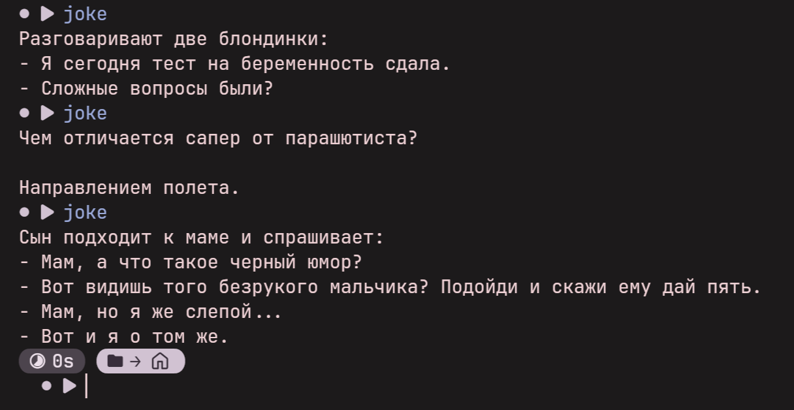

# What it does
Prints a random Russian joke from built-in collection.
The jokes were parsed from the Telegram channel [@jokebeard](https://t.me/jokebeard).



# Why
Made to be used as a tiny utility for displaying random jokes in desktop notifications.

# Installation
This will copy the script to ~/.local/bin/joke and make it executable.
Make sure ~/.local/bin is in your PATH if you want to use it without the full path.
```sh
curl https://github.com/shren7/russian_jokes/joke > ~/.local/bin/joke
chmod +x ~/.local/bin/joke
```

# Usage
```sh
joke
```

# How to send it as a notification
```sh
bash -c 'notify-send "Анекдот" "$(joke)"'
```
If your notification system doesn't use `notify-send`, either alias the appropriate command to `notify-send` or modify the command above.

# How to bind it in Hyprland
Paste this into your Hyprland config file containing your keybinds (by default `~/.config/hypr/hyprland.conf`)
```txt
bind = SUPER+Shift, J, exec, notify-send "Анекдот" "$(joke)"
```
